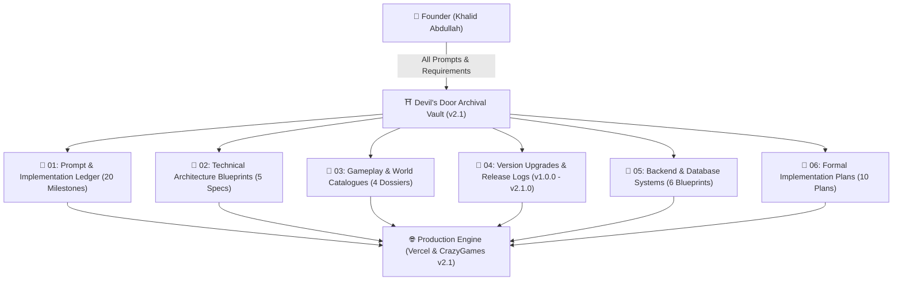

# ⛩️ DEVIL'S DOOR v2.1 — COMPLETE ARCHIVAL VAULT & PROJECT LEDGER

> [!QUOTE] 
> **"REACH THE DOOR. TRUST NOTHING."**  
> *From the creators of Aurex — Founded & Maintained by Khalid Abdullah*

---

## ⚡ Real-Time Project Telemetry

| Metric / Parameter | Value / Status | Direct Link |
|:---|:---|:---:|
| 🏷️ **Current Active Version** | `v2.1.0 (PRODUCTION)` | [[v2.1.0_Publisher_Submission_&_Production_Release]] |
| 🌐 **Live Web Demo** | `PRODUCTION ACTIVE` | [devils-door.vercel.app](https://devils-door.vercel.app/) |
| 🕹️ **Direct Game Portal** | `60 FPS CANVAS` | [devils-door.vercel.app/game](https://devils-door.vercel.app/game) |
| 📦 **GitHub Canonical Repo** | `SYNCHRONIZED` | [github.com/khalidabdullahh/DevilsDoor](https://github.com/khalidabdullahh/DevilsDoor) |
| 🕹️ **CrazyGames Submission** | `AWAITING REVIEW` | `dist-crazygames/` / `devils-door-crazygames.zip` |
| 🛡️ **IP & Legal Protection** | `DUAL LICENSE (MIT + ARR)` | [[Prompt_09_Dual_Licensing_IP_Protection_&_Commercial_Rights]] |
| 🥷 **Playable Shinobi Roster** | `6 UNLOCKED HEROES` | [[Playable_Shinobi_Roster_Dossier]] |
| ⛩️ **Dynamic Biomes** | `6 CYCLIC ATMOSPHERES` | [[Biomes_Atmospheric_Palettes_&_Dynamic_Hazards]] |
| 🎵 **Audio System** | `0KB PROCEDURAL SYNTH` | [[Procedural_Audio_Synthesis_Bible]] |
| 🗄️ **Database & Save Engine** | `LOCALSTORAGE + POSTGRES/REDIS` | [[01_Client_Storage_&_Save_State_Engine]] |
| 📐 **Formal Implementation Plans**| `10 FULL ARCHITECTURAL PLANS` | [[Plan_01_Project_Genesis_&_10_Design_Bibles]] |

---

## 📑 Map of Content (MOC) & Complete Directory

### 📂 01. Complete Prompt Ledger (20 Milestones)
1. [[Prompt_01_Genesis_Architecture_&_Design_Bibles|Prompt 01: Genesis Concept, Specification Bibles & Open-Source Governance Suite]]
2. [[Prompt_02_Responsive_Physics_&_SubPixel_Collisions|Prompt 02: Responsive Kinematics, Coyote Time (100ms) & Jump Buffering (120ms)]]
3. [[Prompt_03_Trigger_Condition_Action_Deception_Engine|Prompt 03: Data-Driven Deception Engine & Modular Door Behaviors]]
4. [[Prompt_04_Procedural_WebAudio_API_Synthesizer|Prompt 04: Zero-Asset Procedural Web Audio API Synthesizer (0 KB SFX)]]
5. [[Prompt_05_Official_6_Hero_Roster_&_Verlet_Cloth_Scarf|Prompt 05: Complete 6-Hero Playable Roster & 9-Node Verlet Cloth Scarf Dynamics]]
6. [[Prompt_06_16_Archive_Scenes_&_3_Minute_Dynamic_Biomes|Prompt 06: 16 Archive Reference Scenes & Dynamic 3-Minute Morphing Biome Engine]]
7. [[Prompt_07_Landing_Page_to_Character_Select_Navigation_Flow|Prompt 07: Unified Landing Page → Character Selection → Endless Run UX Flow]]
8. [[Prompt_08_CrazyGames_SDK_Poki_Developer_Submission|Prompt 08: CrazyGames SDK Integration, Standalone Bundle & Poki Submission]]
9. [[Prompt_09_Dual_Licensing_IP_Protection_&_Commercial_Rights|Prompt 09: Dual-Licensing Architecture & Commercial IP Protection Framework]]
10. [[Prompt_10_Vercel_Edge_Deployment_&_Automated_CI_Testing|Prompt 10: Vercel Edge Hosting, CI Automated Integrity Suite & QA Validation]]
11. [[Prompt_11_Combat_Mechanics_Hitboxes_&_Poise|Prompt 11: High-Octane Combat Mechanics, Directional Attack Hitboxes & Poise]]
12. [[Prompt_12_Mobile_Touch_Controls_Virtual_Joystick_&_Orientation_Safety|Prompt 12: Mobile Touch D-Pad, Jump Sensitivity & Device Rotation Safety Overlay]]
13. [[Prompt_13_In_Game_Shinobi_Quick_Switcher_&_HUD_Overlay|Prompt 13: In-Game Shinobi Quick-Switcher Modal & Real-Time Telemetry HUD]]
14. [[Prompt_14_CrazyGames_SDK_Lifecycle_&_Midgame_Rewarded_Ads|Prompt 14: CrazyGames SDK Monetization Lifecycle (Midgame & Rewarded Revives)]]
15. [[Prompt_15_Standalone_Offline_Bundle_Packaging_&_ZIP_Archiving|Prompt 15: Standalone Offline Relative-Path Build Bundle & ZIP Archiving]]
16. [[Prompt_16_Marketing_Artwork_Suite_Generation_16x9_2x3_1x1|Prompt 16: Marketing Cover Artwork Suite Generation (16:9, 2:3, 1:1 Promos)]]
17. [[Prompt_17_Poki_Developer_Portal_Submission_&_Curation|Prompt 17: Poki Publishing Developer Portal Submission Package]]
18. [[Prompt_18_Anti_Cheat_Run_Verification_Hashing_System|Prompt 18: Anti-Cheat Cryptographic Run Signature Hashing & Speed Caps]]
19. [[Prompt_19_Client_Save_State_Engine_&_Version_Migration|Prompt 19: Client Save State Engine Schema & Automated Version Migration]]
20. [[Prompt_20_Continuous_Integration_Production_Server_Validation|Prompt 20: Automated Node.js Production Server Simulator & CI Test Suite]]

---

### 📂 02. Technical Architecture Blueprints
- [[Architecture_Overview_&_ESM_Pipeline|Architecture Overview & Native Vanilla ESM Pipeline]]
- [[Deception_Engine_State_Machine|Deception Engine State Machine & Event Dispatches]]
- [[Physics_Engine_Kinematics_&_Verlet_Integration|Physics Engine Kinematics, AABB Collisions & Verlet Rope Simulation]]
- [[Procedural_Audio_Synthesis_Bible|Procedural Web Audio Synthesis Bible & Frequency Envelope Formulas]]
- [[2.5D_Silhouette_Rendering_&_Depth_Lighting|2.5D Silhouette Depth Rendering, Parallax & Soft Shadow Lighting]]

---

### 📂 03. Gameplay, Heroes & World Catalogues
- [[Playable_Shinobi_Roster_Dossier|Playable Shinobi Roster Dossier (#01 to #06 Hero Stats & Sprites)]]
- [[Biomes_Atmospheric_Palettes_&_Dynamic_Hazards|Biomes Atmospheric Palettes, Weather Particles & Dynamic Hazards]]
- [[Deceptive_Doors_&_Trap_Catalog|Deceptive Doors & Environmental Traps Catalog]]
- [[Level_Design_Bible_&_The_7_Acts_of_Descent|Level Design Bible, Telegraphing Rules & The 7 Acts of Descent]]

---

### 📂 04. Version Upgrades & Release Logs
- [[v1.0.0_Foundation_Prototype_Release|v1.0.0 — Foundation, 5 Prototype Levels & Open Source Suite]]
- [[v1.5.0_Multi_Hero_Roster_Upgrade|v1.5.0 — 6-Hero Playable Shinobi Roster & Verlet Cloth Integration]]
- [[v1.8.0_Archive_Biomes_&_Dynamic_Cycles|v1.8.0 — 16 Archive Reference Scenes & 3-Minute Dynamic Cycles]]
- [[v2.0.0_Unified_Game_Flow_Upgrade|v2.0.0 — Seamless Landing Page to Character Select UX]]
- [[v2.1.0_Publisher_Submission_&_Production_Release|v2.1.0 — CrazyGames Bundle, Poki Submission & Dual IP Protection (Current Active)]]
- [[Architecture_Decision_Records_ADRs|Architecture Decision Records (ADR-001 through ADR-005)]]

---

### 📂 05. Backend & Database Systems
- [[01_Client_Storage_&_Save_State_Engine|01. Client-Side Storage & Player Save State Engine (LocalStorage & State Machine)]]
- [[02_Telemetry_&_Analytics_Database_Schema|02. Telemetry & Analytics Database Architecture (PostgreSQL Death Heatmaps)]]
- [[03_Vercel_Edge_Serverless_&_Routing_Architecture|03. Vercel Edge Serverless & Routing Architecture (Edge Functions & CDN)]]
- [[04_Global_Leaderboard_&_Cloud_Sync_Database_Spec|04. Global Leaderboard & Cloud Sync Database Spec (Redis Sorted Sets & Anti-Cheat)]]
- [[05_CrazyGames_Cloud_Save_&_User_State_Backend|05. CrazyGames Cloud Save & User Profile Backend Integration]]
- [[06_Local_Server_Runtimes_&_Automated_Testing_Servers|06. Local Server Runtimes & Automated Testing Servers (Node.js & Python)]]

---

### 📂 06. Formal Implementation Plans (Detailed Architectural Design Plans)
Complete technical design proposals with file-by-file changes (`[NEW]`, `[MODIFY]`) and verification criteria:
- [[Plan_01_Project_Genesis_&_10_Design_Bibles|Plan 01: Project Genesis, Governance & 10 Locked Design Bibles]]
- [[Plan_02_Physics_Engine_&_Deception_State_Machine|Plan 02: Responsive Physics Engine & Deception State Machine]]
- [[Plan_03_Procedural_Audio_Synthesizer_&_Zero_Asset_Architecture|Plan 03: Procedural Web Audio Synthesizer & Zero-Asset Architecture]]
- [[Plan_04_Playable_6_Hero_Roster_&_Verlet_Cloth_Physics|Plan 04: Playable 6-Hero Shinobi Roster & Verlet Cloth Dynamics]]
- [[Plan_05_16_Archive_Scenes_&_3_Minute_Dynamic_Biomes|Plan 05: 16 Archive Reference Scenes & Dynamic 3-Minute Biomes]]
- [[Plan_06_Landing_Page_to_Hero_Selection_UX_Flow|Plan 06: Landing Page → Character Selection → Endless Run UX Flow]]
- [[Plan_07_CrazyGames_SDK_v3_Integration_&_Monetization|Plan 07: CrazyGames SDK v3 Integration & Monetization Lifecycle]]
- [[Plan_08_Publisher_Submission_&_Dual_IP_Licensing|Plan 08: Publisher Submission, Marketing Assets & Dual IP Licensing]]
- [[Plan_09_Vercel_Edge_Deployment_&_Automated_CI_Testing|Plan 09: Vercel Edge Deployment & Automated CI Testing]]
- [[Plan_10_Backend_Save_Engine_&_Anti_Cheat_Leaderboard|Plan 10: Backend Save Engine, Telemetry DB & Anti-Cheat Leaderboard]]

---

## 🏷️ Global Vault Tags
`#project/devils-door` `#prompt-log` `#implementation-plan` `#gamedev` `#architecture` `#physics` `#webaudio` `#backend` `#database` `#sql` `#redis` `#serverless` `#v2-1`
