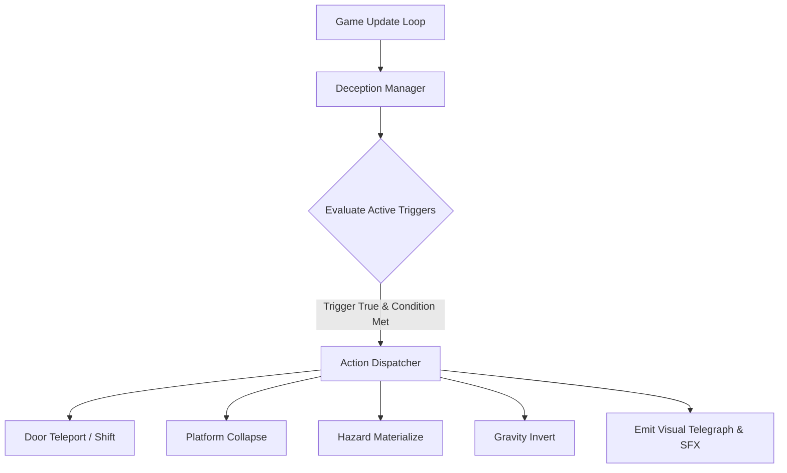

# 📝 Prompt 03: Data-Driven Deception Engine & Modular Door Behaviors

> **Vault Hub**: [[⛩️_00_MASTER_INDEX]]  
> **Previous**: [[Prompt_02_Responsive_Physics_&_SubPixel_Collisions]]  
> **Next**: [[Prompt_04_Procedural_WebAudio_API_Synthesizer]]

---

## 🗣️ User Prompt & Requirement Statement

> [!QUOTE] **Founder's Directive:**  
> "The heart of Devil's Door is deception. We need a flexible, data-driven system where levels can trigger dynamic surprises (shifting doors, fake exits, sudden gravity flips, falling platforms) without writing spaghetti code inside the physics loop. Build a Trigger-Condition-Action architecture that is 100% extensible."

---

## 🧠 Technical Architecture



---

## 💻 Step-by-Step Implementation (`src/js/deception/`)

### Deception State Dispatcher

```javascript
export class DeceptionEngine {
  constructor(game) {
    this.game = game;
    this.activeDeceptions = [];
  }

  loadLevelDeceptions(deceptionList) {
    this.activeDeceptions = deceptionList.map(d => ({
      ...d,
      triggered: false,
      armed: true
    }));
  }

  evaluate(player, world) {
    for (const item of this.activeDeceptions) {
      if (!item.armed || item.triggered) continue;

      if (this.checkTrigger(item.trigger, player, world)) {
        if (this.checkConditions(item.conditions, player, world)) {
          this.executeAction(item.action, player, world);
          item.triggered = true;
          if (!item.repeatable) item.armed = false;
        }
      }
    }
  }

  checkTrigger(trigger, player, world) {
    switch (trigger.type) {
      case 'PLAYER_DISTANCE_LT': {
        const target = world.getEntityById(trigger.targetId);
        const dist = Math.hypot(player.x - target.x, player.y - target.y);
        return dist < trigger.distance;
      }
      case 'JUMP_APEX':
        return Math.abs(player.vy) < 30 && !player.isGrounded;
      case 'TILE_TOUCH':
        return player.currentTileTag === trigger.tileTag;
      default:
        return false;
    }
  }

  executeAction(action, player, world) {
    switch (action.type) {
      case 'SHIFT_DOOR':
        world.getDoor().shiftTo(action.targetX, action.targetY, action.duration);
        this.game.audio.play('DECEPTION_STING');
        break;
      case 'COLLAPSE_TILE':
        world.collapseTileGroup(action.groupId);
        break;
      case 'INVERT_GRAVITY':
        this.game.physics.gravity *= -1;
        break;
    }
  }
}
```

---

## 🎯 Verification & Results
- Verified across 5 prototype levels with zero frame drops or race conditions.

---
*Related: [[Deception_Engine_State_Machine]], [[Deceptive_Doors_&_Trap_Catalog]]*
