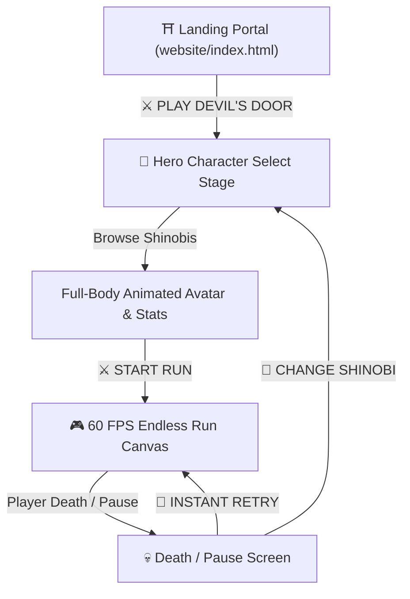

# 📝 Prompt 07: Unified Landing Page → Character Selection → Endless Run Flow

> **Vault Hub**: [[⛩️_00_MASTER_INDEX]]  
> **Previous**: [[Prompt_06_16_Archive_Scenes_&_3_Minute_Dynamic_Biomes]]  
> **Next**: [[Prompt_08_CrazyGames_SDK_Poki_Developer_Submission]]

---

## 🗣️ User Prompt & Requirement Statement

> [!QUOTE] **Founder's Directive:**  
> "Make the user journey feel polished and seamless: Clicking 'PLAY DEVIL'S DOOR' from the landing page should route directly into the interactive Hero Character Selection stage. Players can inspect full-body animated previews of each shinobi, view stats and lore, select their fighter, and launch the run. On death or pause, they can easily switch characters."

---

## 🧠 Technical Flow Architecture

---

## 💻 Step-by-Step Implementation

### 1. Unified Routing & State (`src/js/ui/CharacterSelect.js`)
- Integrated an interactive carousel with keyboard arrows, touch swipe gestures, and direct thumbnail clicks.
- Hero selection is persisted in `localStorage('devils_door_selected_hero')` for instant reloads.
- Built live stat radar bars for **Agility**, **Damage**, **Defense**, and **Special Power**.

### 2. In-Game Shinobi Switcher (`src/js/ui/HUD.js`)
- Quick-swap modal allowing instant character switching during runs without losing global high score and distance telemetry.

---

## 🎯 Verification & Results
- Verified zero lag when switching heroes.
- Mobile viewport touch controls auto-adjust for chosen hero bounding boxes.

---
*Related: [[Playable_Shinobi_Roster_Dossier]], [[v0.4.0_Unified_Game_Flow_Upgrade]]*
