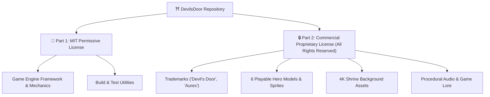

# 📝 Prompt 09: Dual-Licensing Architecture & Commercial IP Protection

> **Vault Hub**: [[⛩️_00_MASTER_INDEX]]  
> **Previous**: [[Prompt_08_CrazyGames_SDK_Poki_Developer_Submission]]  
> **Next**: [[Prompt_10_Vercel_Edge_Deployment_&_Automated_CI_Testing]]

---

## 🗣️ User Prompt & Requirement Statement

> [!QUOTE] **Founder's Directive:**  
> "Ensure that all intellectual property, character designs, game lore, audio synthesis algorithms, 4K background artwork, and branding trademarks (*'Devil's Door'*, *'Aurex'*) remain 100% proprietary and owned by Khalid Abdullah, while allowing the core game engine framework to be open-source. Formulate a robust dual-licensing legal structure."

---

## 🧠 Legal & Architectural Structure

---

## 💻 Step-by-Step Implementation (`LICENSE` & `GOVERNANCE.md`)

### 1. Dual License Architecture (`LICENSE`)
- **Part 1 (MIT)**: Grants open-source rights to the underlying physics, math solvers, and deception engine code.
- **Part 2 (All Rights Reserved)**: Legally reserves 100% of commercial rights, character likenesses, storylines, artwork, and audio assets to **Khalid Abdullah**.

### 2. Commercial Governance (`GOVERNANCE.md`)
- Defines commercial distribution exclusivity.
- Third parties cannot redistribute or commercially monetize Devil's Door characters or assets without express written authorization from Khalid Abdullah.

---

## 🎯 Verification & Deliverables
- [x] Dual-license applied across `LICENSE`, `README.md`, `GOVERNANCE.md`, and `package.json`.
- [x] Founder IP safeguards 100% active.

---
*Related: [[v0.5.0_Publisher_Submission_&_Production_Release]], [[⛩️_00_MASTER_INDEX]]*
