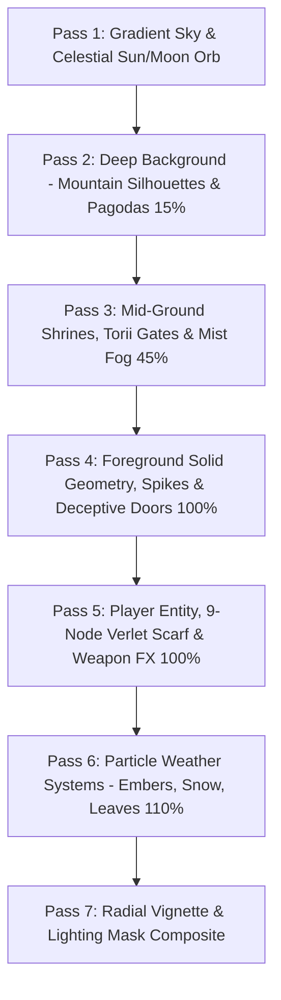

# 🎨 2.5D Silhouette Depth Rendering & Depth Lighting

> **Vault Hub**: [[⛩️_00_MASTER_INDEX]]  
> **Related**: [[Prompt_06_16_Archive_Scenes_&_3_Minute_Dynamic_Biomes]]

---

## 🖌️ Multi-Pass Canvas Rendering Architecture

---

## 🌟 Volumetric Lighting & Reflection Shader Logic
- **Water Wet-Sheen Reflections**: Floor tiles in the Sunset Fortress calculate vertical mirror flips of background pagoda silhouettes with sinusoidal wave displacement:
  $$y_{\text{ref}} = y_{\text{base}} + \sin(x \cdot 0.05 + t \cdot 3) \cdot 2.5$$
- **Soft Volumetric Glow**: Lanterns and Torii gates cast radial gradient luminosity masks using `ctx.globalCompositeOperation = 'lighter'`.

---
*Related: [[⛩️_00_MASTER_INDEX]], [[Biomes_Atmospheric_Palettes_&_Dynamic_Hazards]]*
