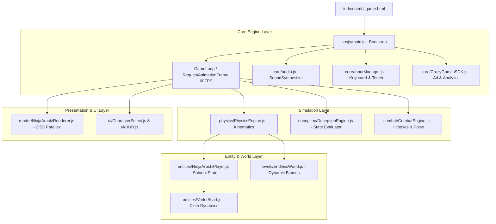

# ⚙️ Architecture Overview & Native ESM Pipeline

> **Vault Hub**: [[⛩️_00_MASTER_INDEX]]  
> **Related**: [[Prompt_01_Genesis_Architecture_&_Design_Bibles]]

---

## 🏛️ System Component Topology

---

## 🚀 Native Zero-Build Philosophy
- **Zero Bundler Overhead**: Devil's Door uses native browser ES Modules. No `node_modules` required for client execution.
- **Immediate Local Execution**: Serving the repository with `python3 -m http.server` or `npx serve` runs the entire production game instantly.

---
*Related: [[⛩️_00_MASTER_INDEX]], [[Deception_Engine_State_Machine]]*
