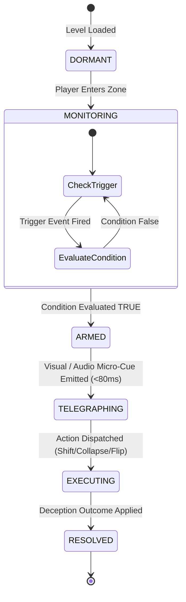

# 👁️ Deception Engine State Machine & Event Pipeline

> **Vault Hub**: [[⛩️_00_MASTER_INDEX]]  
> **Related**: [[Prompt_03_Trigger_Condition_Action_Deception_Engine]], [[Deceptive_Doors_&_Trap_Catalog]]

---

## 🔄 State Machine Lifecycle



---

## 📋 Deception Event Schema Specification

```typescript
interface DeceptionEvent {
  id: string;                      // Unique identifier (e.g. "l4_door_feint")
  trigger: {
    type: 'PROXIMITY' | 'JUMP_APEX' | 'TILE_TOUCH' | 'VELOCITY_GT' | 'IDLE';
    targetId?: string;
    distance?: number;
    threshold?: number;
  };
  conditions: {
    playerGrounded?: boolean;
    hasNotTriggered?: boolean;
    requiredHeroId?: string;
  };
  action: {
    type: 'SHIFT_DOOR' | 'COLLAPSE_TILE' | 'SPAWN_DECOY' | 'INVERT_GRAVITY' | 'GAZE_STRIKE';
    params: Record<string, any>;
    telegraphFx?: string;
    sfxSting?: string;
  };
  repeatable: boolean;
}
```

---
*Related: [[⛩️_00_MASTER_INDEX]], [[Deceptive_Doors_&_Trap_Catalog]]*
