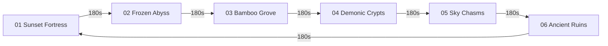

# ⛩️ Biomes Atmospheric Palettes & Dynamic Hazards

> **Vault Hub**: [[⛩️_00_MASTER_INDEX]]  
> **Related**: [[Prompt_06_16_Archive_Scenes_&_3_Minute_Dynamic_Biomes]]

---

## 🎨 6 Biome Aesthetics & Hazard Mapping

### 1. Sunset Fortress & Torii Gate
- **Palette**: Deep Sunset Orange (`#FF5E36`) to Imperial Purple (`#1C0028`).
- **Archive Reference**: `images (4).jpeg`.
- **Dynamic Hazards**: Embedded katana spike traps, collapsing roof tiles, reflective wet floor sheen.

### 2. Frozen Snow Abyss
- **Palette**: Glacial Cyan (`#1C3B5E`) to Deep Navy (`#060E18`).
- **Archive Reference**: `images (3, 5, 7).jpeg`, `media_1788408797536.jpg`.
- **Dynamic Hazards**: Slippery ice ledges, falling icicle stalactites, carved Oni stone pillars.

### 3. Whispering Bamboo Grove
- **Palette**: Jade Emerald (`#0D3320`) to Midnight Green (`#030D08`).
- **Archive Reference**: `images (14).jpeg`.
- **Dynamic Hazards**: Crimson pendulum battleaxes swinging from bamboo canopies.

### 4. Demonic Thorn Crypts
- **Palette**: Lilac Violet (`#42000E`) to Abyssal Black (`#0A0003`).
- **Archive Reference**: `images (10, 17).jpeg`.
- **Dynamic Hazards**: Giant spinning red skull-saw wheels rolling along stone walls.

### 5. Sky Waterfall Chasms
- **Palette**: Turquoise Azure (`#0B2847`) to Dark Sky (`#020B14`).
- **Archive Reference**: `images (1, 16).jpeg`.
- **Dynamic Hazards**: Vertical rising updrafts, mist obscuration, floating stone platforms.

### 6. Ancient Temple Ruins
- **Palette**: Arcane Amethyst (`#261633`) to Obsidian Void (`#09030D`).
- **Archive Reference**: `images (8, 12).jpeg`.
- **Dynamic Hazards**: Pulsing void runestones, shifting gravity zones, shadow devil gaze.

---
*Related: [[⛩️_00_MASTER_INDEX]], [[2.5D_Silhouette_Rendering_&_Depth_Lighting]]*
