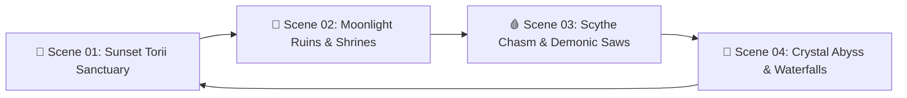

# ⛩️ Biomes, 4K Concept Scenes & Dynamic Hazard Environments

> [!INFO] ⛩️ **DEVIL'S DOOR ARCHIVAL VAULT** · `SCENES & BIOMES CATALOGUE`
> **Status**: `PRODUCTION ACTIVE` 🟢 · **Target Version**: `v2.2.0 Master Edition` · **Maintainer**: `Khalid Abdullah`  
> **Direct Navigation**: [[⛩️_00_MASTER_INDEX|⛩️ Master Hub]] · **Related Plan**: [[Plan_11_New_4_Hero_Shinobi_Roster_HD_Scenes_&_Point_Unlocks|📐 Plan 11]]  
> **Tags**: `#project/devils-door` `#scenes` `#biomes` `#parallax` `#environment` `#v2-2`

---

## 🖼️ The 4 Master 4K Concept Scenes (`Scene/` & `src/assets/backgrounds/`)

---

### 🌅 Scene 01 — Sunset Torii Sanctuary
- **Asset Files**: `Scene/1788505329637.png`, `src/assets/backgrounds/scene_01_sunset_torii.jpg`
- **Atmospheric Palette**: Deep Sunset Crimson (`#9f1239`) $\to$ Solar Gold (`#f59e0b`) $\to$ Obsidian Night (`#1c1032`).
- **Visual Composition**: Dramatic giant Torii gate silhouette centered under a radiant glowing solar halo; multi-tier Japanese pagoda fortress silhouettes in midground; wet reflective slate floor with sinusoidal water sheen reflections.
- **Dynamic Hazards**: Embedded katana spike traps, collapsing wooden pagoda bridges, rising golden embers.

---

### 🌙 Scene 02 — Moonlight Ruins & Ancient Shrines
- **Asset Files**: `Scene/1788505337832.png`, `src/assets/backgrounds/scene_02_moonlight_ruins.jpg`
- **Atmospheric Palette**: Arcane Glacial Cyan (`#38bdf8`) $\to$ Midnight Blue (`#0f2942`) $\to$ Void Black (`#061320`).
- **Visual Composition**: Massive glowing ethereal full moon casting soft blue volumetric light; ancient stone obelisks etched with glowing cyan runes; carved Oni demon stone pillars supporting mountain ledges.
- **Dynamic Hazards**: Slippery frosted stone ledges, falling icicles, pulsing runic void traps.

---

### 🩸 Scene 03 — Scythe Chasm & Demonic Saws
- **Asset Files**: `Scene/1788505348466.png`, `src/assets/backgrounds/scene_03_scythe_chasm.jpg`
- **Atmospheric Palette**: Lilac Twilight (`#581c87`) $\to$ Blood Crimson (`#ef4444`) $\to$ Abyssal Shadow (`#12071a`).
- **Visual Composition**: Demonic mist atmosphere with thorny red demon vines wrapped around decaying castle rooftops; deep abyssal ravines spanned by crumbling stone chains.
- **Dynamic Hazards**: Giant high-speed spinning crimson skull-saw blade wheels, swinging pendulum crescent battleaxes, crumbling platforms.

---

### 🌊 Scene 04 — Crystal Abyss & Waterfall Cascades
- **Asset Files**: `Scene/1788505357144.png`, `src/assets/backgrounds/scene_04_crystal_abyss.jpg`
- **Atmospheric Palette**: Turquoise Azure (`#0d9488`) $\to$ Deep Teal (`#032322`) $\to$ Glacial Mist (`#2dd4bf`).
- **Visual Composition**: Towering vertical waterfall cascades dropping into a glowing chasm; floating fractured obsidian crystal shards with turquoise luminescent mist updrafts.
- **Dynamic Hazards**: Rising vertical updrafts, mist vision obscuration, shifting gravity gates, moving crystal platforms.

---
*Related: [[⛩️_00_MASTER_INDEX]], [[Playable_Shinobi_Roster_Dossier]], [[Plan_11_New_4_Hero_Shinobi_Roster_HD_Scenes_&_Point_Unlocks]]*
