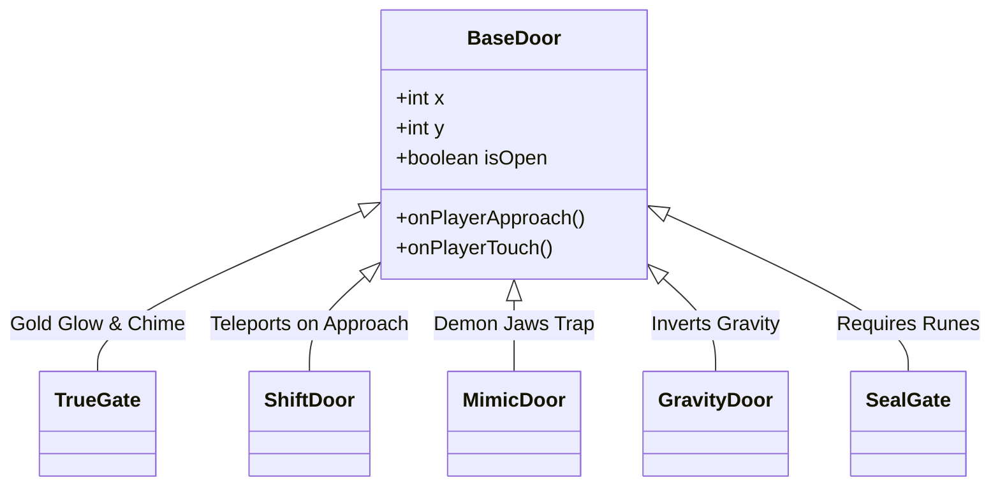

# 🚪 Deceptive Doors & Environmental Traps Catalog

> **Vault Hub**: [[⛩️_00_MASTER_INDEX]]  
> **Related**: [[Deception_Engine_State_Machine]], [[Level_Design_Bible_&_The_7_Acts_of_Descent]]

---

## ⛩️ Deceptive Door Classification

### 1. The True Gate
- **Visual**: Warm ambient gold glow, stable Torii frame.
- **Behavior**: Completes the level immediately upon contact.

### 2. The Shift Door
- **Visual**: Identical to True Gate with microscopic smoke puff.
- **Behavior**: When player enters $<60\text{px}$ proximity, slides or teleports across the arena.
- **Solution**: Approach from above or activate alternative trigger switch to anchor it.

### 3. The Mimic Gate
- **Visual**: Subtle rhythmic frame breathing.
- **Behavior**: Touching causes the archway to snap closed like demon jaws, killing the player.
- **Solution**: Strike with Katana or Shuriken before approaching to dispel the illusion.

### 4. The Gravity Inversion Gate
- **Visual**: Upward drifting dust particles around the threshold.
- **Behavior**: Stepping through inverts gravity vector, requiring players to platform upside-down.

---
*Related: [[⛩️_00_MASTER_INDEX]], [[Deception_Engine_State_Machine]]*
