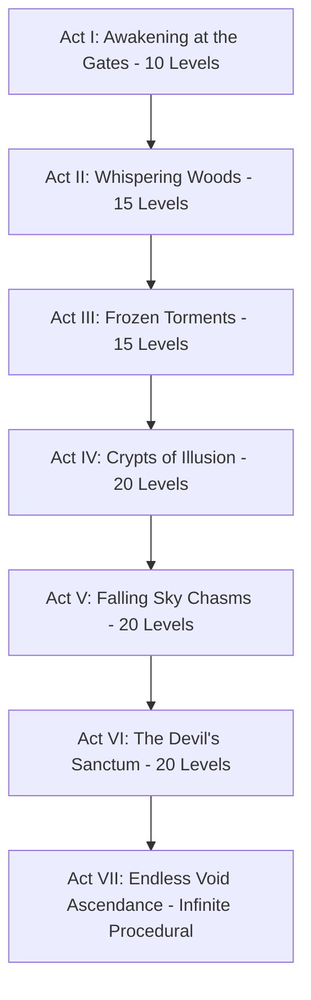

# 📐 Level Design Bible & The 7 Acts of Descent

> **Vault Hub**: [[⛩️_00_MASTER_INDEX]]  
> **Related**: [[Deceptive_Doors_&_Trap_Catalog]], [[Biomes_Atmospheric_Palettes_&_Dynamic_Hazards]]

---

## 🗺️ Narrative Progression: The 7 Acts of Descent

---

## ⚖️ The 4 Laws of Level Fairplay

1. **Law of the Single Eureka**: Every level teaches exactly one primary deceptive rule or mechanic. Do not overload a stage with multiple unrelated tricks.
2. **Law of Instant Forgiveness**: Respawns must trigger within $<80\text{ms}$ with zero intermediate death screens to preserve player flow state.
3. **Law of Sub-Minute Mastery**: A solved level must be clearable in $10-30\text{ seconds}$ of clean execution.
4. **Law of Visual Honesty**: Any trap that triggers must have left behind physical or audio evidence of why it occurred.

---
*Related: [[⛩️_00_MASTER_INDEX]], [[v0.1.0_Foundation_Prototype_Release]]*
