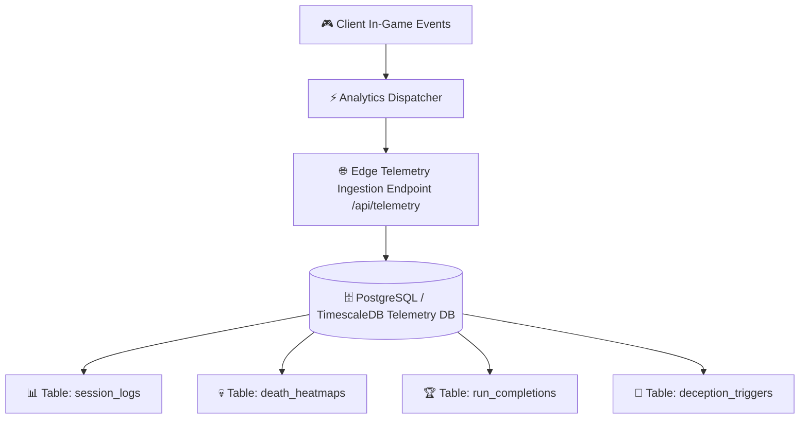

# 📊 Telemetry & Analytics Database Architecture

> **Vault Hub**: [[⛩️_00_MASTER_INDEX]]  
> **Related**: [[01_Client_Storage_&_Save_State_Engine]], [[03_Vercel_Edge_Serverless_&_Routing_Architecture]]

---

## 🎯 Architectural Mission & Privacy Guarantees

The **Devil's Door Telemetry Database** is engineered to capture gameplay balance events, level completion friction, and death coordinates for generating spatial **Death Heatmaps** without collecting any Personal Identifiable Information (PII) or IP addresses.



---

## 🗄️ PostgreSQL Database Schema Definition

### 1. `session_logs` Table (Platform & Client Distribution)

```sql
CREATE TABLE session_logs (
    session_id UUID PRIMARY KEY DEFAULT gen_random_uuid(),
    player_id VARCHAR(64) NOT NULL,
    client_version VARCHAR(16) NOT NULL DEFAULT '2.1.0',
    viewport_type VARCHAR(16) CHECK (viewport_type IN ('desktop_landscape', 'mobile_landscape', 'mobile_portrait')),
    device_pixel_ratio NUMERIC(3, 2),
    selected_hero_id VARCHAR(32) NOT NULL,
    started_at TIMESTAMPTZ NOT NULL DEFAULT NOW(),
    duration_seconds INTEGER DEFAULT 0
);

CREATE INDEX idx_session_version ON session_logs(client_version);
CREATE INDEX idx_session_hero ON session_logs(selected_hero_id);
```

### 2. `death_heatmaps` Table (Spatial Hazard Analysis)

```sql
CREATE TABLE death_heatmaps (
    event_id BIGSERIAL PRIMARY KEY,
    session_id UUID REFERENCES session_logs(session_id) ON DELETE CASCADE,
    hero_id VARCHAR(32) NOT NULL,
    biome_id VARCHAR(32) NOT NULL,
    distance_meters INTEGER NOT NULL,
    death_coord_x NUMERIC(8, 2) NOT NULL,
    death_coord_y NUMERIC(8, 2) NOT NULL,
    killer_hazard_tag VARCHAR(64) NOT NULL, -- e.g. 'spinning_saw_04', 'mimic_door', 'falling_icicle'
    velocity_at_death_x NUMERIC(6, 2),
    velocity_at_death_y NUMERIC(6, 2),
    time_alive_seconds NUMERIC(6, 2) NOT NULL,
    recorded_at TIMESTAMPTZ NOT NULL DEFAULT NOW()
);

CREATE INDEX idx_heatmap_coords ON death_heatmaps(biome_id, death_coord_x, death_coord_y);
CREATE INDEX idx_heatmap_hazard ON death_heatmaps(killer_hazard_tag);
```

### 3. `deception_trigger_logs` Table (Trap Fairness Calibration)

```sql
CREATE TABLE deception_trigger_logs (
    trigger_id BIGSERIAL PRIMARY KEY,
    session_id UUID REFERENCES session_logs(session_id),
    deception_node_id VARCHAR(64) NOT NULL, -- e.g. 'feint_door_biome_2'
    player_distance_at_trigger NUMERIC(6, 2),
    result_action VARCHAR(32) NOT NULL,    -- 'DOOR_SHIFT', 'COLLAPSE', 'GRAVITY_INVERT'
    player_survived BOOLEAN NOT NULL DEFAULT FALSE,
    reaction_time_ms INTEGER,
    triggered_at TIMESTAMPTZ NOT NULL DEFAULT NOW()
);

CREATE INDEX idx_deception_survival ON deception_trigger_logs(deception_node_id, player_survived);
```

---

## 📈 Aggregation Query: Generating Death Heatmaps for Level Balancing

```sql
-- Query to identify top 5 lethal choke points in the Frozen Snow Abyss biome
SELECT 
    killer_hazard_tag,
    ROUND(death_coord_x / 50.0) * 50 AS grid_cluster_x,
    ROUND(death_coord_y / 50.0) * 50 AS grid_cluster_y,
    COUNT(*) AS total_fatalities,
    AVG(time_alive_seconds)::NUMERIC(5,1) AS avg_survival_before_fatal_trap
FROM death_heatmaps
WHERE biome_id = 'FROZEN_ABYSS'
GROUP BY killer_hazard_tag, grid_cluster_x, grid_cluster_y
ORDER BY total_fatalities DESC
LIMIT 5;
```

---
*Related: [[⛩️_00_MASTER_INDEX]], [[01_Client_Storage_&_Save_State_Engine]], [[03_Vercel_Edge_Serverless_&_Routing_Architecture]]*
