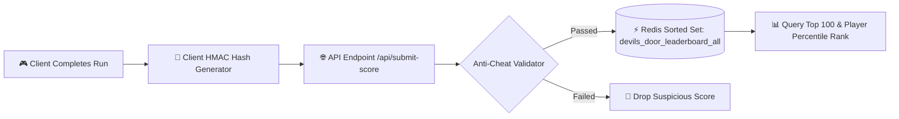

# 🏆 Global Leaderboard & Cloud Sync Database Specification

> **Vault Hub**: [[⛩️_00_MASTER_INDEX]]  
> **Related**: [[01_Client_Storage_&_Save_State_Engine]], [[03_Vercel_Edge_Serverless_&_Routing_Architecture]]

---

## ⚡ High-Throughput Redis / Upstash Leaderboard Architecture

For millisecond-speed global ranking across thousands of concurrent players, Devil's Door uses **Redis Sorted Sets (`ZSET`)** with cryptographic run verification hashes.



---

## 🗄️ Redis Data Structures & Command Operations

### 1. Global Leaderboard Sorted Set (`devils_door_global_distance`)
- **Key**: `leaderboard:global:v2`
- **Score**: Distance in meters (e.g. `1840`)
- **Member**: Player UUID or Username (e.g. `usr_91af23:ShadowNinja`)

```redis
-- Add / Update Player Run Distance
ZADD leaderboard:global:v2 1840 "usr_91af23:ShadowNinja"

-- Fetch Top 10 Global Players with Scores
ZREVRANGE leaderboard:global:v2 0 9 WITHSCORES

-- Fetch Specific Player's Global Rank (0-indexed)
ZREVRANK leaderboard:global:v2 "usr_91af23:ShadowNinja"

-- Fetch Total Competitor Count
ZCARD leaderboard:global:v2
```

---

## 🔒 Anti-Cheat Cryptographic Verification Hash

To prevent bad actors from tampering with HTTP payloads and submitting impossible scores (e.g. 99,999 meters in 2 seconds), submissions require a **Deterministic Run Verification Signature**:

$$\text{Signature} = \text{HMAC-SHA256}\Big(\text{Secret}, \; \text{distance} \,\|\, \text{timeElapsedSec} \,\|\, \text{killCount} \,\|\, \text{heroId}\Big)$$

### Server-Side Validation Rules:
1. **Speed Cap Ceiling**: $\frac{\text{distance}}{\text{timeElapsedSec}} \le 35.0\text{ m/s}$ (Maximum sprint + dash burst velocity).
2. **Kill Feasibility**: $\text{killCount} \le \text{distance} \times 0.08$ (Enemy density threshold).
3. **Signature Match**: Recomputed server HMAC must strictly match the client payload header.

---
*Related: [[⛩️_00_MASTER_INDEX]], [[01_Client_Storage_&_Save_State_Engine]], [[05_CrazyGames_Cloud_Save_&_User_State_Backend]]*
