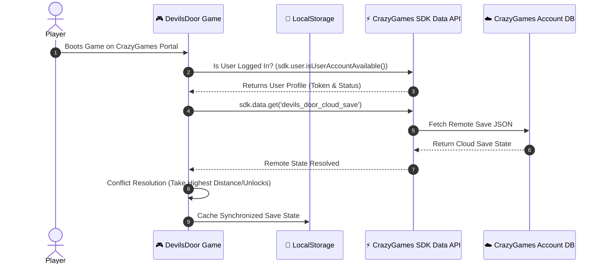

# 🕹️ CrazyGames Cloud Save & User State Backend Integration

> **Vault Hub**: [[⛩️_00_MASTER_INDEX]]  
> **Related**: [[01_Client_Storage_&_Save_State_Engine]], [[Prompt_08_CrazyGames_SDK_Poki_Developer_Submission]]

---

## ☁️ Publisher Cloud Synchronization Workflow

When Devil's Door runs inside the **CrazyGames Portal**, player progress is synchronized directly to the player's CrazyGames account backend via the **CrazyGames SDK Data Module** (`window.CrazyGames.SDK.data`).



---

## 💻 Implementation Interface (`src/js/core/PublisherCloudSync.js`)

```javascript
export class PublisherCloudSync {
  constructor(crazyGamesBridge) {
    this.bridge = crazyGamesBridge;
  }

  async saveToCloud(stateData) {
    if (window.CrazyGames && window.CrazyGames.SDK && window.CrazyGames.SDK.data) {
      try {
        await window.CrazyGames.SDK.data.save('devils_door_cloud_save', JSON.stringify(stateData));
        console.log('[CloudSync] Successfully persisted to CrazyGames Cloud DB');
      } catch (err) {
        console.warn('[CloudSync] Failed to sync with CrazyGames backend', err);
      }
    }
  }

  async loadFromCloud() {
    if (window.CrazyGames && window.CrazyGames.SDK && window.CrazyGames.SDK.data) {
      try {
        const raw = await window.CrazyGames.SDK.data.get('devils_door_cloud_save');
        if (raw) return JSON.parse(raw);
      } catch (err) {
        console.warn('[CloudSync] Failed to fetch remote CrazyGames save', err);
      }
    }
    return null;
  }
}
```

---
*Related: [[⛩️_00_MASTER_INDEX]], [[01_Client_Storage_&_Save_State_Engine]]*
