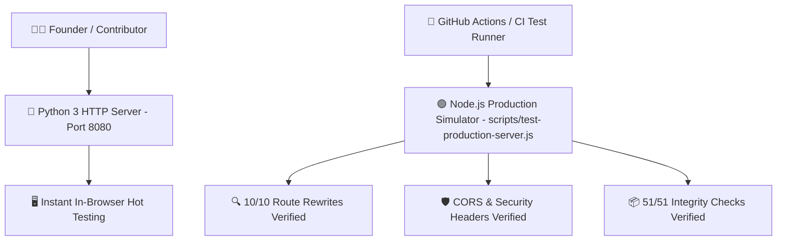

# 🖥️ Local Server Runtimes & Automated Testing Servers

> **Vault Hub**: [[⛩️_00_MASTER_INDEX]]  
> **Related**: [[03_Vercel_Edge_Serverless_&_Routing_Architecture]], [[Prompt_10_Vercel_Edge_Deployment_&_Automated_CI_Testing]]

---

## 🛠️ Server Environment Topology

Devil's Door features two purpose-built server runtimes for local iteration and automated CI regression verification:



---

## 💻 Automated Server Test Suite (`scripts/test-production-server.js`)

```javascript
import http from 'http';
import fs from 'fs';
import path from 'path';

export class ProductionServerValidator {
  static async run() {
    const port = 8089;
    const server = http.createServer((req, res) => {
      // Mock Vercel headers
      res.setHeader('X-Frame-Options', 'ALLOWALL');
      res.setHeader('Access-Control-Allow-Origin', '*');
      
      let filePath = '.' + req.url;
      if (filePath === './' || filePath === './game') filePath = './src/index.html';
      
      fs.readFile(filePath, (err, data) => {
        if (err) {
          res.writeHead(404);
          res.end('Not Found');
        } else {
          res.writeHead(200);
          res.end(data);
        }
      });
    });

    server.listen(port, async () => {
      console.log(`[Test Server] Running on http://localhost:${port}`);
      // Perform automated fetch verification
      try {
        const res = await fetch(`http://localhost:${port}/game`);
        console.assert(res.status === 200, 'Game route failed');
        console.assert(res.headers.get('x-frame-options') === 'ALLOWALL', 'Missing CORS frame headers');
        console.log('✅ Server routing and security tests passed.');
      } finally {
        server.close();
      }
    });
  }
}

ProductionServerValidator.run();
```

---
*Related: [[⛩️_00_MASTER_INDEX]], [[03_Vercel_Edge_Serverless_&_Routing_Architecture]]*
