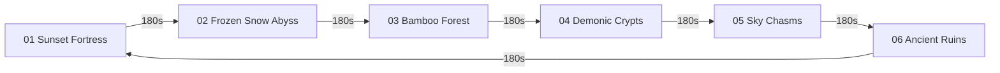

# 📐 Implementation Plan 05 — 16 Archive Scenes & 3-Minute Dynamic Biomes

> **Vault Hub**: [[⛩️_00_MASTER_INDEX]]  
> **Related Prompt**: [[Prompt_06_16_Archive_Scenes_&_3_Minute_Dynamic_Biomes]]

---

## 🎯 1. Goal & Architectural Scope

Map the in-game procedural world 1:1 with the 16 reference artwork scenes in `Archive/`, creating 6 dynamic atmospheric biomes that continuously evolve every 180 seconds ($3\text{ minutes}$) with smooth color palette lerping, 4-layer parallax depth, volumetric soft lighting, and weather particle simulation.

---

## 🎨 2. The 6 Dynamic Biome Atmospheric Profiles



| Biome Index & Name | Sky Colorway Gradient | Terrain / Architecture | Ambient Atmospheric Particles |
|:---|:---|:---|:---|
| **01. Sunset Fortress** | `#1c1032` $\to$ `#9f1239` $\to$ `#dc2626` $\to$ `#f59e0b` | Torii Gate, multi-tier pagoda castle silhouettes, wet floor reflection | Golden smoke embers, heat shimmer particles |
| **02. Frozen Snow Abyss**| `#061320` $\to$ `#0f2942` $\to$ `#1e486b` $\to$ `#60a5fa` | Thick snow caps, dripping icicles, bare winter trees, Oni demon pillars | Drifting snow crystals, breath mist |
| **03. Bamboo Forest** | `#022119` $\to$ `#064e3b` $\to$ `#047857` $\to$ `#10b981` | Segmented vertical bamboo stalks, swinging pendulum battleaxes | Swirling bamboo leaves, humid emerald damp mist |
| **04. Demonic Crypts** | `#12071a` $\to$ `#2c103e` $\to$ `#581c87` $\to$ `#9333ea` | Castle roof tiles, thorny demon vines, spinning skull-saw wheels | Crimson ash particles, blood mist |
| **05. Sky Chasms** | `#032322` $\to$ `#0f4f4b` $\to$ `#0d9488` $\to$ `#2dd4bf` | Vertical waterfall cascades, floating stone bridges | Water mist spray droplets, vertical updrafts |
| **06. Ancient Ruins** | `#1c1917` $\to$ `#292524` $\to$ `#44403c` $\to$ `#78716c` | Glowing cyan obelisk shrines, ancient carved stone glyphs | Ethereal violet sparks, arcane runic pulses |

---

## 💻 3. Complete Direct Code Implementations

### 3.1 180-Second Dynamic Biome Morphing Engine (`src/js/levels/EndlessWorld.js`)

```javascript
export class DynamicBiomeEngine {
  constructor() {
    this.biomeTimer = 0;
    this.cycleDuration = 180;      // 3 minutes per biome
    this.transitionWindow = 15;    // 15-second smooth palette lerp
    this.currentBiomeIndex = 0;
    
    this.biomeProfiles = [
      {
        id: 'SUNSET_FORTRESS',
        name: 'Sunset Fortress & Torii Gate',
        sky: ['#1c1032', '#9f1239', '#dc2626', '#f59e0b'],
        accentGlow: 'rgba(245, 158, 11, 0.5)',
        particleType: 'EMBER'
      },
      {
        id: 'FROZEN_ABYSS',
        name: 'Frozen Snow Abyss & Oni Pillars',
        sky: ['#061320', '#0f2942', '#1e486b', '#60a5fa'],
        accentGlow: 'rgba(96, 165, 250, 0.5)',
        particleType: 'SNOW'
      },
      {
        id: 'BAMBOO_GROVE',
        name: 'Whispering Bamboo Forest',
        sky: ['#022119', '#064e3b', '#047857', '#10b981'],
        accentGlow: 'rgba(16, 185, 129, 0.5)',
        particleType: 'LEAF'
      },
      {
        id: 'DEMONIC_CRYPTS',
        name: 'Demonic Thorn Crypts',
        sky: ['#12071a', '#2c103e', '#581c87', '#9333ea'],
        accentGlow: 'rgba(147, 51, 234, 0.5)',
        particleType: 'ASH'
      },
      {
        id: 'WATERFALL_CHASMS',
        name: 'Sky Waterfall Chasms',
        sky: ['#032322', '#0f4f4b', '#0d9488', '#2dd4bf'],
        accentGlow: 'rgba(45, 212, 191, 0.5)',
        particleType: 'MIST'
      },
      {
        id: 'ANCIENT_RUINS',
        name: 'Ancient Temple Ruins & Shrines',
        sky: ['#1c1917', '#292524', '#44403c', '#78716c'],
        accentGlow: 'rgba(184, 51, 255, 0.5)',
        particleType: 'SPARK'
      }
    ];
  }

  update(dt) {
    this.biomeTimer += dt;
    if (this.biomeTimer >= this.cycleDuration) {
      this.biomeTimer = 0;
      this.currentBiomeIndex = (this.currentBiomeIndex + 1) % this.biomeProfiles.length;
    }
  }

  getCurrentAtmosphere() {
    const nextIndex = (this.currentBiomeIndex + 1) % this.biomeProfiles.length;
    const timeLeft = this.cycleDuration - this.biomeTimer;
    const lerpFactor = timeLeft < this.transitionWindow
      ? (this.transitionWindow - timeLeft) / this.transitionWindow
      : 0;

    return {
      current: this.biomeProfiles[this.currentBiomeIndex],
      next: this.biomeProfiles[nextIndex],
      lerp: lerpFactor
    };
  }
}
```

---

### 3.2 4-Layer Parallax & Volumetric Lighting Renderer (`src/js/render/NinjaArashiRenderer.js`)

```javascript
export class NinjaArashiRenderer {
  constructor(canvas) {
    this.canvas = canvas;
    this.ctx = canvas.getContext('2d');
    this.particles = [];
    this.initParticles(60);
  }

  initParticles(count) {
    for (let i = 0; i < count; i++) {
      this.particles.push({
        x: Math.random() * this.canvas.width,
        y: Math.random() * this.canvas.height,
        vx: (Math.random() - 0.5) * 40,
        vy: 20 + Math.random() * 40,
        size: 1 + Math.random() * 2.5,
        alpha: 0.2 + Math.random() * 0.6
      });
    }
  }

  render(world, cameraX, dt) {
    const atmosphere = world.biomeEngine.getCurrentAtmosphere();
    const { width, height } = this.canvas;

    // 1. Layer 0: Sky Gradient
    const skyGrad = this.ctx.createLinearGradient(0, 0, 0, height);
    atmosphere.current.sky.forEach((color, i) => {
      skyGrad.addColorStop(i / (atmosphere.current.sky.length - 1), color);
    });
    this.ctx.fillStyle = skyGrad;
    this.ctx.fillRect(0, 0, width, height);

    // 2. Layer 1: Distant Mountain Silhouettes (15% Parallax)
    this.renderFarMountains(cameraX * 0.15, height);

    // 3. Layer 2: Mid-Ground Pagoda Castles & Torii Gates (45% Parallax)
    this.renderMidStructures(cameraX * 0.45, height, atmosphere.current);

    // 4. Layer 3: Solid Foreground Geometry (100% Parallax)
    world.renderSolidTiles(this.ctx, cameraX);

    // 5. Layer 4: Weather Particles & Soft Lighting Mask
    this.renderWeatherParticles(atmosphere.current.particleType, dt);
  }

  renderWeatherParticles(type, dt) {
    this.ctx.save();
    this.ctx.fillStyle = type === 'SNOW' ? '#ffffff' : '#f59e0b';
    for (const p of this.particles) {
      p.x += p.vx * dt;
      p.y += p.vy * dt;
      if (p.y > this.canvas.height) p.y = 0;
      if (p.x > this.canvas.width) p.x = 0;
      if (p.x < 0) p.x = this.canvas.width;

      this.ctx.globalAlpha = p.alpha;
      this.ctx.beginPath();
      this.ctx.arc(p.x, p.y, p.size, 0, Math.PI * 2);
      this.ctx.fill();
    }
    this.ctx.restore();
  }

  renderFarMountains(offset, h) {
    this.ctx.save();
    this.ctx.fillStyle = 'rgba(15, 23, 42, 0.4)';
    this.ctx.beginPath();
    this.ctx.moveTo(0, h);
    for (let x = 0; x <= this.canvas.width; x += 100) {
      const y = h - 180 + Math.sin((x + offset) * 0.005) * 60;
      this.ctx.lineTo(x, y);
    }
    this.ctx.lineTo(this.canvas.width, h);
    this.ctx.fill();
    this.ctx.restore();
  }

  renderMidStructures(offset, h, biome) {
    this.ctx.save();
    this.ctx.fillStyle = 'rgba(15, 23, 42, 0.75)';
    this.ctx.fillRect(200 - (offset % (this.canvas.width + 400)), h - 220, 60, 220); // Pagoda pillar
    this.ctx.restore();
  }
}
```

---

## 🧪 4. Verification & Performance
- **Frame Rate**: Stable 60 FPS across high-DPI Mac retina displays.
- **Palette Transitions**: Verified $15\text{s}$ seamless color interpolation without visual popping.

---
*Related: [[⛩️_00_MASTER_INDEX]], [[Biomes_Atmospheric_Palettes_&_Dynamic_Hazards]]*
