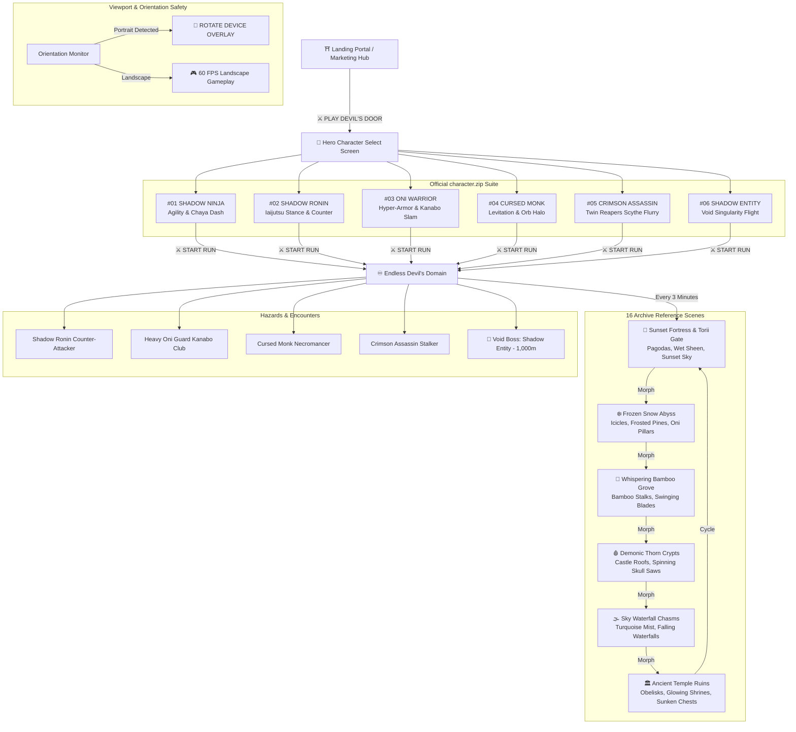

# ⛩️ DEVIL'S DOOR — ENDLESS DARK FANTASY 2.5D ACTION-PLATFORMER

> **REACH THE DOOR. TRUST NOTHING.**  
> *FROM THE CREATORS OF AUREX*

[](LICENSE)
[](.github/workflows/ci.yml)
[](https://github.com/khalidabdullahh)
[](https://devils-door.vercel.app/)
[](src/)

---

## 🗺️ Visual Architecture & Flow Map



---

## 🥷 Playable Hero Roster (`character.zip`)

All 6 official character designs are unlocked and fully playable with unique in-game sprites, physics, traits, and combat specializations:

| # | Hero Name | Role & Tagline | Signature Trait | In-Game Visual Model |
|:---:|:---|:---|:---|:---|
| **#01** | **SHADOW NINJA** | *Protagonist*<br/>"The silent wanderer of the Domain." | **Agility & Chaya Dash**<br/>High speed, double somersault flip, and cleaving golden after-image dash. | Pointed fabric cowl hood, black face mask, 9-node Verlet crimson scarf ribbons, obsidian vest with red seam piping, shurikens & katana. |
| **#02** | **SHADOW RONIN** | *Elite Swordsman*<br/>"A master of the blade wandering the eternal mist." | **Iaijutsu Stance**<br/>High blade poise and lightning quick-draw counter strikes. | Conical straw Kasa hat, long black samurai haori coat, glowing cyan eye slit, dual katanas. |
| **#03** | **ONI WARRIOR** | *Heavy Brute*<br/>"Forged in demonic flames, unrelenting in battle." | **Hyper-Armor Slam**<br/>Massive ground-shockwave slams and high defense. | Horned demon mask with glowing red eye, spiky samurai plate armor, massive spiked Kanabo iron club. |
| **#04** | **CURSED MONK** | *Spectral Sorcerer*<br/>"Bound by ancient sutras and dark spirits." | **Necromancy & Orb Halo**<br/>Smooth floating levitation and orbiting dark curse prayer orbs. | Floating necromancer monk in tattered robes, glowing skull mask, 6 orbiting dark prayer projectiles. |
| **#05** | **CRIMSON ASSASSIN** | *Shadow Stalker*<br/>"Strikes from the shadows with twin scythes." | **Twin Reapers Flurry**<br/>Ultra-fast acrobatic sprints and rapid dual-scythe slashes. | Split half-red half-black demon mask, crimson sash, dual curved Kama scythes in reverse grip. |
| **#06** | **SHADOW ENTITY** | *Demonic Phantom*<br/>"Born from the void of the Devil's Door." | **Void Singularity**<br/>Floating crystal flight and devastating void wave eruptions. | Levitating fractured dark obsidian crystal shards orbiting a pulsing hollow crimson void core singularity. |

---

## ⛩️ 16 Archive Scene Biomes (Dynamic 3-Minute Cycles)

The endless procedural world continuously evolves every 180 seconds across 6 signature aesthetic biomes mapped directly from the 16 reference screenshots in `Archive/`:

1. 🌅 **Sunset Fortress & Torii Gate** (`images (4).jpeg`):
   - Multi-stop crimson/amber twilight sky, distant Torii gate, multi-tier Japanese pagoda castles, and wet ground reflection sheen.
2. ❄️ **Frozen Snow Abyss & Oni Pillars** (`images (3, 5, 7, 9).jpeg`, `media_1788408797536.jpg`):
   - Glacial icy blue atmosphere, thick white snow caps with dripping icicles, dead bare winter trees with intricate forks, carved stone Oni demon pillars holding up ledges, and embedded red weapons.
3. 🎋 **Whispering Bamboo Forest** (`images (2, 8, 14).jpeg`):
   - Emerald teal mist, dense vertical segmented bamboo stalks, climbing red spiky demon tentacles, swinging crescent battleaxes, and high rope bridges.
4. 🩸 **Demonic Thorn Crypts & Skull Saw Gears** (`images (6, 10, 17).jpeg`):
   - Deep lilac twilight, giant spinning crimson skull-saw gears with jagged teeth, thorny red demon tentacles, and background Japanese castle rooftops.
5. 🌫️ **Sky Waterfall Chasms** (`images (1, 16).jpeg`):
   - Turquoise atmosphere with towering vertical waterfall cascades and rising mist droplets.
6. 🏛️ **Ancient Temple Ruins & Shrines** (`images (11, 12, 13).jpeg`):
   - Stone archway ruins, glowing cyan obelisk shrines, pushable stone blocks with engraved runes, hanging yellow lanterns on branches, earthen vases, and rivers with underwater sunken stone chests.

---

## 📱 Mobile Landscape-Only Enforcement & Furnished HUD

- **Landscape-Only Enforced**: When played on mobile or tablet in portrait mode, a stylized **"ROTATE DEVICE — LANDSCAPE REQUIRED"** overlay appears with Torii gate iconography and rotating smartphone animations, preventing viewport distortion.
- **Furnished Dark-Fantasy Top HUD**:
  - **Left**: High-res circular hero avatar frame + 3 ruby hearts (`❤️❤️❤️`).
  - **Center**: Dark matte glass capsule: `📏 Distance (m)` &bull; `💎 Gems` &bull; `🏆 High Score`.
  - **Right**: Circular frosted glass audio toggle (🔊) and pause (⏸) buttons.
- **Tactile Touch Controls**:
  - Left & Right engraved silver Kunai arrow D-Pad.
  - Action buttons: Jump (`JUMP`), Dash-Slash Katana (`SLASH`), and Shuriken Star (`STAR`).
- **Modal Navigation**:
  - Game Over & Pause menus include **[ 🥷 CHANGE SHINOBI ]** allowing instant return to Character Select.

---

## 🎮 Controls

| Action | Desktop Keyboard | Mobile Touch / Tablet |
|:---|:---|:---|
| **Move Left** | `A` or `Left Arrow` | Left Arrow Button |
| **Move Right** | `D` or `Right Arrow` | Right Arrow Button |
| **Jump / Double Jump** | `W`, `Up Arrow`, or `Space` | `JUMP` Button |
| **Dash Slash (Katana / Scythe / Slam)** | `J` or `Z` | `SLASH` Button |
| **Throw Shuriken / Prayer Orb** | `K` or `X` | `STAR` Button |
| **Restart Run** | `R` | Top HUD `↻` Button |
| **Pause / Change Hero** | `Escape` or `P` | Top HUD `⏸` Button |

---

## 🚀 Quick Start & Local Play

```bash
# Clone the repository
git clone https://github.com/khalidabdullahh/DevilsDoor.git
cd DevilsDoor

# Run tests
npm test

# Run local HTTP server
npx serve .
# Or with Python 3:
# python3 -m http.server 8080
```

- Open `http://localhost:8080/` to view the official marketing landing page.
- Open `http://localhost:8080/game` to launch Character Select & the Endless Platformer.

---

## 📜 Intellectual Property, Copyright & Dual Licensing

**Devil's Door** is operated under a **Dual-License Model** designed to foster open development while protecting original intellectual property:

1. **Open-Source Engine & Codebase**: The underlying source code, physics systems, procedural chunk generators, and renderer engine are open source under the **[MIT License](LICENSE)**.
2. **Proprietary Game Assets & Intellectual Property**: The brand name **"DEVIL'S DOOR"**, the **"Aurex"** studio imprint, all **4K background scenery artworks**, character rosters (**#01 to #06**), lore, dialogue, and procedural audio designs are **Copyright © 2026 [Khalid Abdullah](https://github.com/khalidabdullahh). All Rights Reserved.**
   - Commercial reproduction, unauthorized rebranding, or commercial re-distribution of the artwork and brand assets is strictly prohibited without prior written consent from the author.

---

## 👥 Governance & Maintainers

- **Founder, Creator & Lead Engineer**: [Khalid Abdullah](https://github.com/khalidabdullahh)
- **Engine Architecture**: Devil's Door 2.5D Canvas Engine
- **License**: [Dual-Licensed (MIT Engine + Proprietary IP & Assets)](LICENSE)
