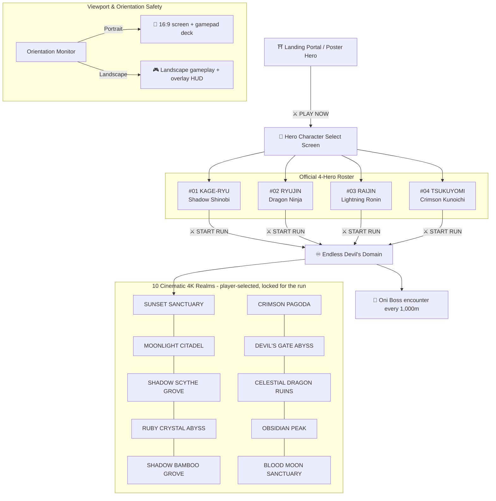

# ⛩️ DEVIL'S DOOR — ENDLESS DARK FANTASY 2.5D ACTION-PLATFORMER

> **REACH THE DOOR. TRUST NOTHING.**  
> *FROM THE CREATORS OF AUREX*

[](LICENSE)
[](.github/workflows/ci.yml)
[](https://github.com/khalidabdullahh)
[](https://devilsdoor.js.org/)
[](src/)

---

## 🗺️ Visual Architecture & Flow Map


```mermaid
graph TD
    Landing[⛩️ Landing Portal / Poster Hero] -->|⚔️ PLAY NOW| CharSelect[🥷 Hero Character Select Screen]

    subgraph Character Select Roster [Official 4-Hero Roster]
        H1[#01 KAGE-RYU<br/>Shadow Shinobi]
        H2[#02 RYUJIN<br/>Dragon Ninja]
        H3[#03 RAIJIN<br/>Lightning Ronin]
        H4[#04 TSUKUYOMI<br/>Crimson Kunoichi]
    end

    CharSelect --> H1
    CharSelect --> H2
    CharSelect --> H3
    CharSelect --> H4

    H1 -->|⚔️ START RUN| EndlessRun[♾️ Endless Devil's Domain]
    H2 -->|⚔️ START RUN| EndlessRun
    H3 -->|⚔️ START RUN| EndlessRun
    H4 -->|⚔️ START RUN| EndlessRun

    subgraph Realms [10 Cinematic 4K Realms - player-selected, locked for the run]
        R1[SUNSET SANCTUARY] --- R2[MOONLIGHT CITADEL] --- R3[SHADOW SCYTHE GROVE] --- R4[RUBY CRYSTAL ABYSS] --- R5[SHADOW BAMBOO GROVE]
        R6[CRIMSON PAGODA] --- R7[DEVIL'S GATE ABYSS] --- R8[CELESTIAL DRAGON RUINS] --- R9[OBSIDIAN PEAK] --- R10[BLOOD MOON SANCTUARY]
    end

    EndlessRun --> R1
    EndlessRun --> Boss[👹 Oni Boss encounter every 1,000m]

    subgraph Viewport & Orientation Safety
        PortraitCheck[Orientation Monitor] -->|Portrait| Handheld[📱 16:9 screen + gamepad deck]
        PortraitCheck -->|Landscape| ActiveCanvas[🎮 Landscape gameplay + overlay HUD]
    end
```

---

## 🥷 Playable Hero Roster

The official 4-hero roster (source of truth: `src/js/data/CharacterRoster.js`). All four are currently unlocked.

| # | Hero | Title | Accent | Speed | Jump |
|:---:|:---|:---|:---:|:---:|:---:|
| **#01** | **KAGE-RYU** | Shadow Shinobi | `#a855f7` | 95 | 90 |
| **#02** | **RYUJIN** | Dragon Ninja | `#f97316` | 80 | 78 |
| **#03** | **RAIJIN** | Lightning Ronin | `#38bdf8` | 90 | 88 |
| **#04** | **TSUKUYOMI** | Crimson Kunoichi | `#ef4444` | 100 | 95 |

---

## ⛩️ The 10 Realms

Players pick one of 10 cinematic 4K realms (source of truth: `src/js/data/SceneRoster.js`); the chosen realm stays active for the whole run. Order: Sunset Sanctuary, Moonlight Citadel, Shadow Scythe Grove, Ruby Crystal Abyss, Shadow Bamboo Grove, Crimson Pagoda, Devil's Gate Abyss, Celestial Dragon Ruins, Obsidian Peak, Blood Moon Sanctuary. Each realm has its own terrain theme.

---

## 📱 Mobile (Landscape + Portrait Handheld) & HUD

- **Two layouts**: landscape uses an overlay HUD; on phones/tablets in portrait the game shows a 16:9 screen on top with a gamepad deck below (`OrientationManager`).
- **Furnished Dark-Fantasy Top HUD**:
  - **Left**: High-res circular hero avatar frame + 3 ruby hearts (`❤️❤️❤️`).
  - **Center**: Dark matte glass capsule: `📏 Distance (m)` &bull; `💎 Gems` &bull; `🏆 High Score`.
  - **Right**: Circular frosted glass audio toggle (🔊) and pause (⏸) buttons.
- **Tactile Touch Controls**:
  - Left & Right engraved silver Kunai arrow D-Pad.
  - Action buttons: Jump (`JUMP`), Dash-Slash Katana (`SLASH`), and Shuriken Star (`STAR`).
- **Modal Navigation**:
  - Game Over & Pause menus include **[ 🥷 CHANGE SHINOBI ]** allowing instant return to Character Select.

---

## 🎮 Controls

| Action | Desktop Keyboard | Mobile Touch / Tablet |
|:---|:---|:---|
| **Move Left** | `A` or `Left Arrow` | Left Arrow Button |
| **Move Right** | `D` or `Right Arrow` | Right Arrow Button |
| **Jump / Double Jump** | `W`, `Up Arrow`, or `Space` | `JUMP` Button |
| **Dash Slash (Katana / Scythe / Slam)** | `J` or `Z` | `SLASH` Button |
| **Throw Shuriken / Prayer Orb** | `K` or `X` | `STAR` Button |
| **Restart Run** | `R` | Top HUD `↻` Button |
| **Pause / Change Hero** | `Escape` or `P` | Top HUD `⏸` Button |

---

## 🚀 Quick Start & Local Play

```bash
# Clone the repository
git clone https://github.com/khalidabdullahh/DevilsDoor.git
cd DevilsDoor

# Run tests
npm test

# Run local HTTP server
npx serve .
# Or with Python 3:
# python3 -m http.server 8080
```

- Open `http://localhost:8080/` to view the official marketing landing page.
- Open `http://localhost:8080/game` to launch Character Select & the Endless Platformer.

---

## 📜 Intellectual Property, Copyright & Dual Licensing

**Devil's Door** is operated under a **Dual-License Model** designed to foster open development while protecting original intellectual property:

1. **Open-Source Engine & Codebase**: The underlying source code, physics systems, procedural chunk generators, and renderer engine are open source under the **[MIT License](LICENSE)**.
2. **Proprietary Game Assets & Intellectual Property**: The brand name **"DEVIL'S DOOR"**, the **"Aurex"** studio imprint, all **4K background scenery artworks**, character rosters (**#01 to #04**), lore, dialogue, and procedural audio designs are **Copyright © 2026 [Khalid Abdullah](https://github.com/khalidabdullahh). All Rights Reserved.**
   - Commercial reproduction, unauthorized rebranding, or commercial re-distribution of the artwork and brand assets is strictly prohibited without prior written consent from the author.

---

## 👥 Governance & Maintainers

- **Founder, Creator & Lead Engineer**: [Khalid Abdullah](https://github.com/khalidabdullahh)
- **Engine Architecture**: Devil's Door 2.5D Canvas Engine
- **License**: [Dual-Licensed (MIT Engine + Proprietary IP & Assets)](LICENSE)

---

## 🌌 Landing page: the cinematic journey

The cinematic page (`/cinematic`; `/` is now the poster-style hero) is a scroll-driven, mostly-WebGL experience: **scroll = walk through the world**: a red moon behind a giant torii, a tunnel of gates, the four shinobi, the ten realms, and finally the Devil's Door. It is plain HTML/CSS/ES modules + a vendored Three.js (no build step) and falls back to a normal readable page without JS, without WebGL, with reduced motion, or with data-saver.

- How it is built, how to test it and the Cloudflare gotchas: [`AGENTS.md`](AGENTS.md#5b-cinematic-landing-cinematichtml-read-this-before-touching-it)
- What is done and what is left, phase by phase: [`docs/LANDING_ROADMAP.md`](docs/LANDING_ROADMAP.md)
- The creative brief: [`docs/LANDING_BRIEF.md`](docs/LANDING_BRIEF.md)

```bash
npm run serve          # local server that behaves like Cloudflare Pages (/game -> game.html), http://localhost:8080
npm run test:all       # integrity + gameplay + world + HUD + landing/select checks
```

## ☁️ Deploying to Cloudflare Pages

Static site, no build command, output directory = repo root. There is no `_redirects` file on purpose: do **not** add `/game /game.html 200` style rewrites (infinite redirect: Pages already serves `game.html` at `/game`). Keep `_headers` rules non-overlapping. Per-file limit 25 MiB.

